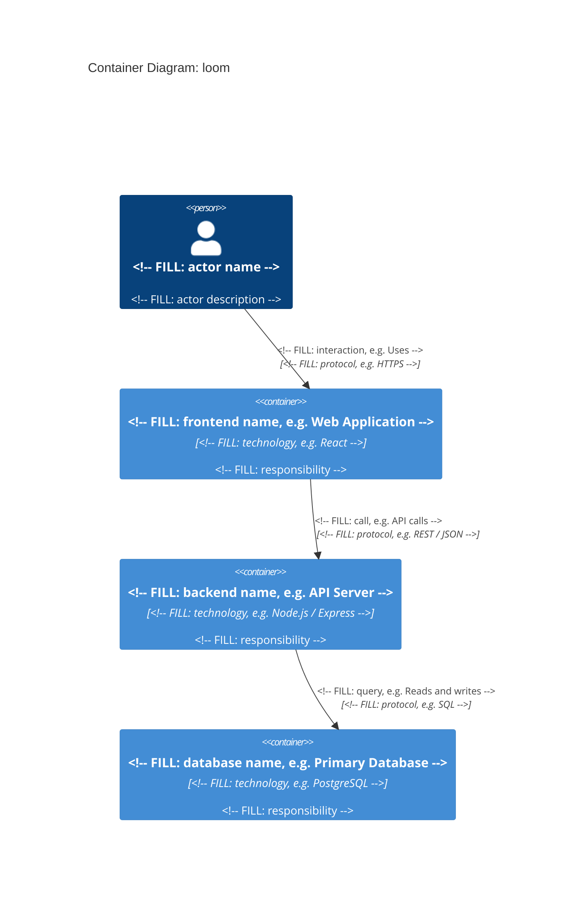

<!-- UNFILLED: C4 Container Diagram -->
<!-- Replace container labels, technology fields, and relations with your stack -->
# Container Diagram — loom

```mermaid
C4Container
    title Container Diagram: loom

    Person(user, "<!-- FILL: actor name -->", "<!-- FILL: actor description -->")

    Container(web, "<!-- FILL: frontend name, e.g. Web Application -->", "<!-- FILL: technology, e.g. React -->", "<!-- FILL: responsibility -->")
    Container(api, "<!-- FILL: backend name, e.g. API Server -->", "<!-- FILL: technology, e.g. Node.js / Express -->", "<!-- FILL: responsibility -->")
    Container(db, "<!-- FILL: database name, e.g. Primary Database -->", "<!-- FILL: technology, e.g. PostgreSQL -->", "<!-- FILL: responsibility -->")

    Rel(user, web, "<!-- FILL: interaction, e.g. Uses -->", "<!-- FILL: protocol, e.g. HTTPS -->")
    Rel(web, api, "<!-- FILL: call, e.g. API calls -->", "<!-- FILL: protocol, e.g. REST / JSON -->")
    Rel(api, db, "<!-- FILL: query, e.g. Reads and writes -->", "<!-- FILL: protocol, e.g. SQL -->")
```
