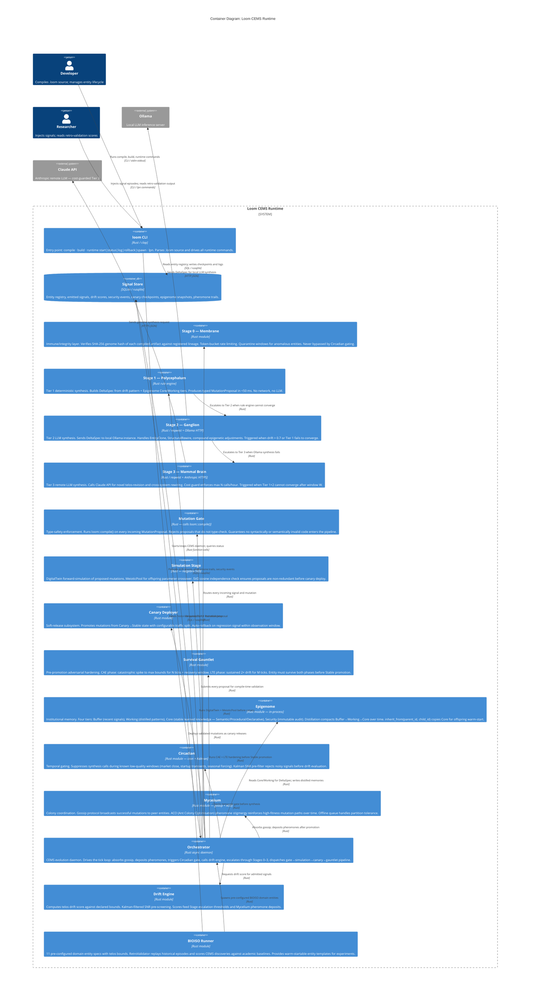

# Container Diagram — Loom CEMS Runtime

```mermaid
C4Container
    title Container Diagram: Loom CEMS Runtime

    Person(developer, "Developer", "Compiles .loom source; manages entity lifecycle")
    Person(researcher, "Researcher", "Injects signals; reads retro-validation scores")

    System_Ext(ollama, "Ollama", "Local LLM inference server")
    System_Ext(claude, "Claude API", "Anthropic remote LLM — cost-guarded Tier 3")

    System_Boundary(loom_system, "Loom CEMS Runtime") {

        Container(cli, "loom CLI", "Rust / clap", "Entry point: compile · build · runtime start|status|log|rollback|spawn · lpn. Parses .loom source and drives all runtime commands.")

        ContainerDb(signal_store, "Signal Store", "SQLite / rusqlite", "Entity registry, emitted signals, drift scores, security events, canary checkpoints, epigenome snapshots, pheromone trails.")

        Container(membrane, "Stage 0 — Membrane", "Rust module", "Immune/integrity layer. Verifies SHA-256 genome hash of each compiled artifact against registered lineage. Token-bucket rate limiting. Quarantine windows for anomalous entities. Never bypassed by Circadian gating.")

        Container(polycephalum, "Stage 1 — Polycephalum", "Rust rule engine", "Tier 1 deterministic synthesis. Builds DeltaSpec from drift pattern + Epigenome Core/Working tiers. Produces typed MutationProposal in <50 ms. No network, no LLM.")

        Container(ganglion, "Stage 2 — Ganglion", "Rust / reqwest + Ollama HTTP", "Tier 2 LLM synthesis. Sends DeltaSpec to local Ollama instance. Handles EntityClone, StructuralRewire, compound epigenetic adjustments. Triggered when drift > 0.7 or Tier 1 fails to converge.")

        Container(mammal_brain, "Stage 3 — Mammal Brain", "Rust / reqwest + Anthropic HTTPS", "Tier 3 remote LLM synthesis. Calls Claude API for novel telos-revision and cross-system rewiring. Cost guard enforces max N calls/hour. Triggered when Tier 1+2 cannot converge after window W.")

        Container(mutation_gate, "Mutation Gate", "Rust — calls loom::compile()", "Type-safety enforcement. Runs loom::compile() on every incoming MutationProposal. Rejects proposals that do not type-check. Guarantees no syntactically or semantically invalid code enters the pipeline.")

        Container(simulation, "Simulation Stage", "Rust — nalgebra SVD", "DigitalTwin forward-simulation of proposed mutations. MeioticPool for offspring parameter crossover. SVD cosine independence check ensures proposals are non-redundant before canary deploy.")

        Container(canary, "Canary Deployer", "Rust module", "Soft-release subsystem. Promotes mutations from Canary→Stable state with configurable traffic split. Auto-rollback on regression signal within observation window.")

        Container(gauntlet, "Survival Gauntlet", "Rust module", "Pre-promotion adversarial hardening. CAE phase: catastrophic spike to max bounds for N ticks + recovery window. LTE phase: sustained 2× drift for M ticks. Entity must survive both phases before Stable promotion.")

        Container(epigenome, "Epigenome", "Rust module — in-process", "Institutional memory. Four tiers: Buffer (recent signals), Working (distilled patterns), Core (stable learned knowledge — Semantic/Procedural/Declarative), Security (immutable audit). Distillation compacts Buffer→Working→Core over time. inherit_from(parent_id, child_id) copies Core for offspring warm-start.")

        Container(circadian, "Circadian", "Rust module — cron + Kalman", "Temporal gating. Suppresses synthesis calls during known low-quality windows (market close, startup transients, seasonal forcing). Kalman SNR pre-filter rejects noisy signals before drift evaluation.")

        Container(mycelium, "Mycelium", "Rust module — gossip + ACO", "Colony coordination. Gossip protocol broadcasts successful mutations to peer entities. ACO (Ant Colony Optimisation) pheromone stigmergy reinforces high-fitness mutation paths over time. Offline queue handles partition tolerance.")

        Container(orchestrator, "Orchestrator", "Rust async daemon", "CEMS evolution daemon. Drives the tick loop: absorbs gossip, deposits pheromones, triggers Circadian gate, calls drift engine, escalates through Stages 0–3, dispatches gate→simulation→canary→gauntlet pipeline.")

        Container(drift_engine, "Drift Engine", "Rust module", "Computes telos drift score against declared bounds. Kalman-filtered SNR pre-screening. Scores feed Stage escalation thresholds and Mycelium pheromone deposits.")

        Container(bioiso_runner, "BIOISO Runner", "Rust module", "11 pre-configured domain entity specs with telos bounds. RetroValidator replays historical episodes and scores CEMS discoveries against academic baselines. Provides warm-startable entity templates for experiments.")
    }

    Rel(developer, cli, "Runs compile, build, runtime commands", "CLI / stdin-stdout")
    Rel(researcher, cli, "Injects signal episodes; reads retro-validation output", "CLI / lpn commands")

    Rel(cli, signal_store, "Reads entity registry; writes checkpoints and logs", "SQL / rusqlite")
    Rel(cli, orchestrator, "Starts/stops CEMS daemon; queries status", "Rust function calls")

    Rel(orchestrator, membrane, "Routes every incoming signal and mutation", "Rust")
    Rel(orchestrator, drift_engine, "Requests drift score for admitted signals", "Rust")
    Rel(orchestrator, circadian, "Checks temporal gate before synthesis", "Rust")
    Rel(orchestrator, polycephalum, "Requests Tier 1 mutation proposal", "Rust")
    Rel(orchestrator, mutation_gate, "Submits every proposal for compile-time validation", "Rust")
    Rel(orchestrator, simulation, "Runs DigitalTwin + MeioticPool before canary", "Rust")
    Rel(orchestrator, canary, "Deploys validated mutations as canary releases", "Rust")
    Rel(orchestrator, gauntlet, "Runs CAE + LTE hardening before Stable promotion", "Rust")
    Rel(orchestrator, epigenome, "Reads Core/Working for DeltaSpec; writes distilled memories", "Rust")
    Rel(orchestrator, mycelium, "Absorbs gossip; deposits pheromones after promotion", "Rust")
    Rel(orchestrator, signal_store, "Persists drift scores, pheromone trails, security events", "SQL / rusqlite")

    Rel(polycephalum, ganglion, "Escalates to Tier 2 when rule engine cannot converge", "Rust")
    Rel(ganglion, mammal_brain, "Escalates to Tier 3 when Ollama synthesis fails", "Rust")

    Rel(ganglion, ollama, "Sends DeltaSpec for local LLM synthesis", "HTTP JSON")
    Rel(mammal_brain, claude, "Sends genome synthesis request", "HTTPS JSON")

    Rel(bioiso_runner, signal_store, "Reads historical episodes for RetroValidator", "SQL / rusqlite")
    Rel(bioiso_runner, orchestrator, "Spawns pre-configured BIOISO domain entities", "Rust")
```
