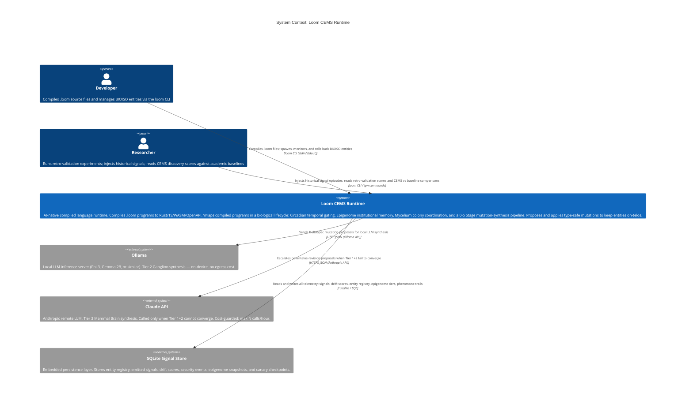

# System Context Diagram — Loom CEMS

```mermaid
C4Context
  title System Context: Loom CEMS Runtime

  Person(developer, "Developer", "Compiles .loom source files and manages BIOISO entities via the loom CLI")
  Person(researcher, "Researcher", "Runs retro-validation experiments; injects historical signals; reads CEMS discovery scores against academic baselines")

  System(loom, "Loom CEMS Runtime", "AI-native compiled language runtime. Compiles .loom programs to Rust/TS/WASM/OpenAPI. Wraps compiled programs in a biological lifecycle: Circadian temporal gating, Epigenome institutional memory, Mycelium colony coordination, and a 0-5 Stage mutation-synthesis pipeline. Proposes and applies type-safe mutations to keep entities on-telos.")

  System_Ext(ollama, "Ollama", "Local LLM inference server (Phi-3, Gemma 2B, or similar). Tier 2 Ganglion synthesis — on-device, no egress cost.")
  System_Ext(claude, "Claude API", "Anthropic remote LLM. Tier 3 Mammal Brain synthesis. Called only when Tier 1+2 cannot converge. Cost-guarded: max N calls/hour.")
  System_Ext(sqlite, "SQLite Signal Store", "Embedded persistence layer. Stores entity registry, emitted signals, drift scores, security events, epigenome snapshots, and canary checkpoints.")

  Rel(developer, loom, "Compiles .loom files; spawns, monitors, and rolls back BIOISO entities", "loom CLI (stdin/stdout)")
  Rel(researcher, loom, "Injects historical signal episodes; reads retro-validation scores and CEMS vs baseline comparisons", "loom CLI / lpn commands")

  Rel(loom, ollama, "Sends DeltaSpec mutation proposals for local LLM synthesis", "HTTP JSON (Ollama API)")
  Rel(loom, claude, "Escalates novel telos-revision proposals when Tier 1+2 fail to converge", "HTTPS JSON (Anthropic API)")
  Rel(loom, sqlite, "Reads and writes all telemetry: signals, drift scores, entity registry, epigenome tiers, pheromone trails", "rusqlite / SQL")

  UpdateLayoutConfig($c4ShapeInRow="3", $c4BoundaryInRow="1")
```
