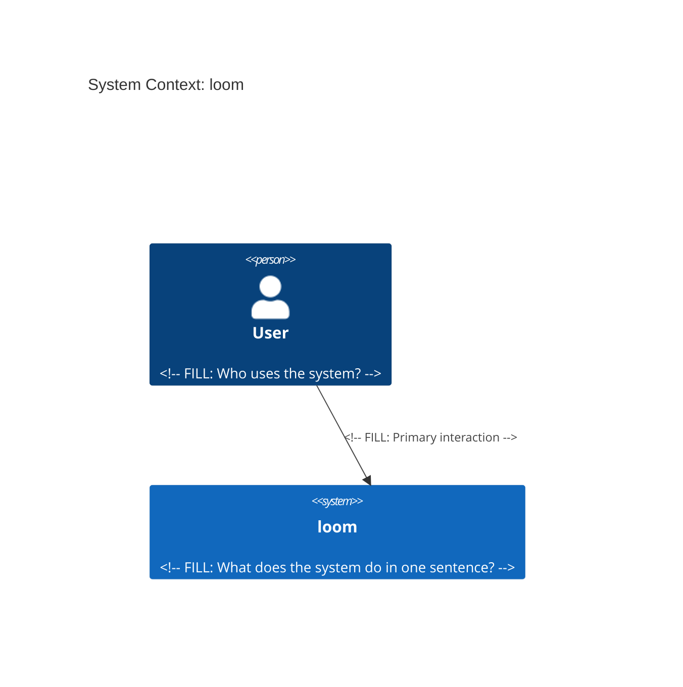

<!-- UNFILLED: C4 Context Diagram -->
<!-- Run `forgecraft generate_diagram` to auto-generate from your spec -->
# System Context Diagram

```mermaid
C4Context
  title System Context: loom
  Person(user, "User", "<!-- FILL: Who uses the system? -->")
  System(system, "loom", "<!-- FILL: What does the system do in one sentence? -->")
  Rel(user, system, "<!-- FILL: Primary interaction -->")
```
