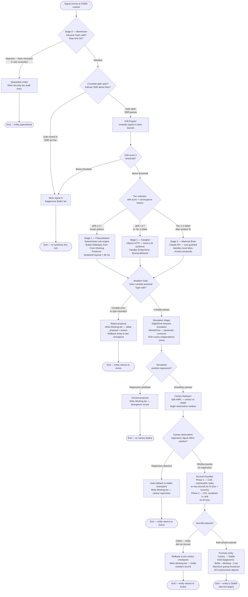

# Flow: CEMS Mutation Proposal Pipeline

```mermaid
flowchart TD
    Start([Signal arrives at CEMS runtime])

    Start --> MemCheck{Stage 0 — Membrane:\nGenome hash valid?\nRate limit OK?}

    MemCheck -->|Rejected — hash mismatch\nor rate exceeded| Quarantine[Quarantine entity\nWrite Security tier audit entry]
    Quarantine --> End_Reject([End — entity quarantined])

    MemCheck -->|Admitted| CircadianGate{Circadian gate open?\nKalman SNR above floor?}

    CircadianGate -->|Gate closed or\nSNR too low| BufferOnly[Write signal to\nEpigenome Buffer tier]
    BufferOnly --> End_NoSynth([End — no synthesis this tick])

    CircadianGate -->|Gate open\nSNR passes| DriftEval[Drift Engine:\nevaluate signal vs telos bounds]

    DriftEval --> DriftCheck{Drift score ≥\nthreshold?}

    DriftCheck -->|Below threshold| BufferOnly

    DriftCheck -->|Above threshold| TierSelect{Tier selection:\ndrift score + convergence history}

    TierSelect -->|drift ≤ 0.7\nknown pattern| Tier1[Stage 1 — Polycephalum\nDeterministic rule engine\nBuilds DeltaSpec from Core+Working\nProduces MutationProposal < 50 ms]

    TierSelect -->|drift > 0.7\nor Tier 1 failed| Tier2[Stage 2 — Ganglion\nOllama HTTP — local LLM synthesis\nHandles EntityClone, StructuralRewire]

    TierSelect -->|Tier 1+2 failed\nafter window W| Tier3[Stage 3 — Mammal Brain\nClaude API — cost-guarded\nHandles novel telos-revision proposals]

    Tier1 --> GateValidate
    Tier2 --> GateValidate
    Tier3 --> GateValidate

    GateValidate{Mutation Gate:\nloom::compile proposal\nType-safe?}

    GateValidate -->|Compile error\nor type mismatch| GateReject[Reject proposal\nWrite Working tier — failed proposal + reason\nRollback entity to last checkpoint]
    GateReject --> End_GateReject([End — entity returns to Active])

    GateValidate -->|Compile passes| SimStage[Simulation Stage:\nDigitalTwin forward-simulation\nMeioticPool — parameter crossover\nSVD cosine independence check]

    SimStage --> SimCheck{Simulation\npredicts regression?}

    SimCheck -->|Regression predicted| SimRollback[Discard proposal\nWrite Working tier — divergence record]
    SimRollback --> End_SimRollback([End — no canary deploy])

    SimCheck -->|Simulation passes| CanaryDeploy[Canary Deployer:\nsplit traffic — canary vs stable\nbegin observation window]

    CanaryDeploy --> CanaryObs{Canary observation:\nregression signal within window?}

    CanaryObs -->|Regression detected| AutoRollback[Auto-rollback to stable checkpoint\nWrite Working tier — canary regression]
    AutoRollback --> End_AutoRollback([End — entity returns to Active])

    CanaryObs -->|Window passes\nno regression| Gauntlet[Survival Gauntlet:\nPhase 1 — CAE: catastrophic spike\nto max bounds for N ticks + recovery\nPhase 2 — LTE: sustained 2× drift\nfor M ticks]

    Gauntlet --> GauntletCheck{Gauntlet passed?}

    GauntletCheck -->|Failed — entity\ndid not recover| GauntletFail[Rollback to pre-canary checkpoint\nWrite Working tier — brittle mutation record]
    GauntletFail --> End_GauntletFail([End — entity returns to Active])

    GauntletCheck -->|Both phases passed| Promote[Promote entity:\nCanary → Stable\nDistil Epigenome: Buffer→Working→Core\nMycelium gossip broadcast\nACO pheromone deposit]

    Promote --> End_Promote([End — entity is Stable\nnext tick begins])
```
