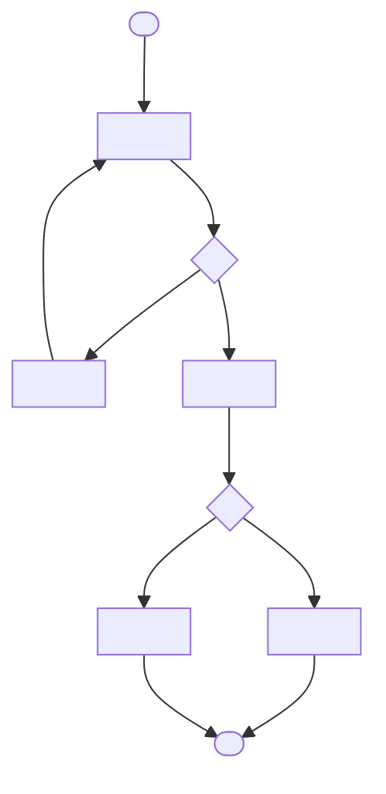

<!-- UNFILLED: Flow Diagram — UC-01: Primary Use Case -->
<!-- Replace node labels and edge conditions with real user journey steps -->
# Flow: UC-01: Primary Use Case

```mermaid
flowchart TD
    Start([<!-- FILL: trigger, e.g. User opens registration page -->])

    Start --> Input[<!-- FILL: first action, e.g. Fill in name, email, password -->]
    Input --> Validate{<!-- FILL: validation check, e.g. All fields valid? -->}

    Validate -->|<!-- FILL: failure label, e.g. Invalid -->| Error[<!-- FILL: error action, e.g. Show validation errors -->]
    Error --> Input

    Validate -->|<!-- FILL: success label, e.g. Valid -->| Process[<!-- FILL: main action, e.g. Create account -->]
    Process --> Check{<!-- FILL: guard check, e.g. Email already exists? -->}

    Check -->|<!-- FILL: conflict label, e.g. Yes -->| Conflict[<!-- FILL: conflict action, e.g. Show duplicate email error -->]
    Conflict --> End([<!-- FILL: exit label, e.g. User corrects email -->])

    Check -->|<!-- FILL: proceed label, e.g. No -->| Success[<!-- FILL: success action, e.g. Send confirmation email -->]
    Success --> End
```
