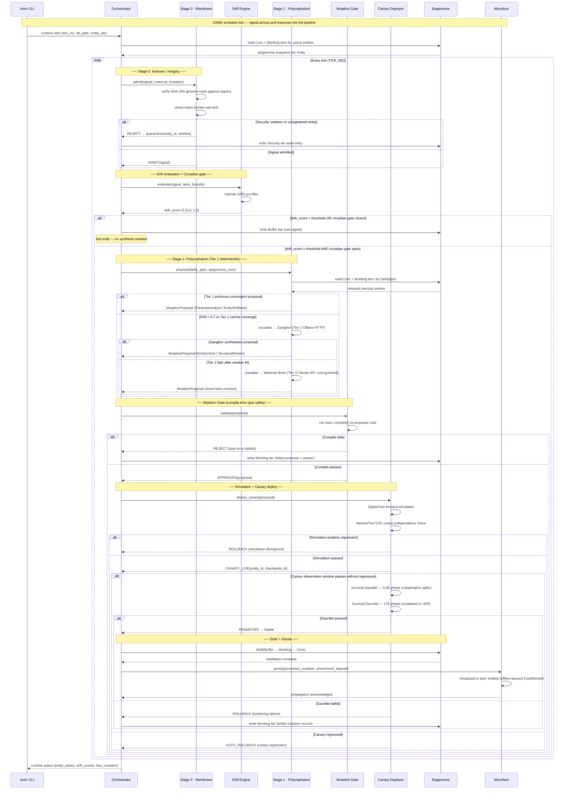

# Sequence Diagram: CEMS Evolution Tick

```mermaid
sequenceDiagram
    participant CLI as loom CLI
    participant Orch as Orchestrator
    participant Mem as Stage 0 · Membrane
    participant Drift as Drift Engine
    participant Poly as Stage 1 · Polycephalum
    participant Gate as Mutation Gate
    participant Canary as Canary Deployer
    participant Epi as Epigenome
    participant Myc as Mycelium

    Note over CLI,Myc: CEMS evolution tick — signal arrives and traverses the full pipeline

    CLI->>Orch: runtime start (tick_ms, db_path, entity_ids)
    Orch->>Epi: load Core + Working tiers for active entities
    Epi-->>Orch: epigenome snapshot per entity

    loop Every tick (TICK_MS)

        Note over Orch,Mem: ── Stage 0: Immune / Integrity ──
        Orch->>Mem: admit(signal | external_mutation)
        Mem->>Mem: verify SHA-256 genome hash against registry
        Mem->>Mem: check token-bucket rate limit

        alt Security violation or unregistered entity
            Mem-->>Orch: REJECT → quarantine(entity_id, window)
            Orch->>Epi: write Security tier audit entry
        else Signal admitted
            Mem-->>Orch: ADMIT(signal)
        end

        Note over Orch,Drift: ── Drift evaluation + Circadian gate ──
        Orch->>Drift: evaluate(signal, telos_bounds)
        Drift->>Drift: Kalman SNR pre-filter
        Drift-->>Orch: drift_score ∈ [0.0, 1.0]

        alt drift_score < threshold OR circadian gate closed
            Orch->>Epi: write Buffer tier (raw signal)
            Note over Orch: tick ends — no synthesis needed
        else drift_score ≥ threshold AND circadian gate open

            Note over Orch,Poly: ── Stage 1: Polycephalum (Tier 1 deterministic) ──
            Orch->>Poly: propose(delta_spec, epigenome_core)
            Poly->>Epi: read Core + Working tiers for DeltaSpec
            Epi-->>Poly: relevant memory entries

            alt Tier 1 produces convergent proposal
                Poly-->>Orch: MutationProposal (ParameterAdjust | EntityRollback)
            else Drift > 0.7 or Tier 1 cannot converge
                Poly->>Poly: escalate → Ganglion (Tier 2 Ollama HTTP)

                alt Ganglion synthesises proposal
                    Poly-->>Orch: MutationProposal (EntityClone | StructuralRewire)
                else Tier 2 fails after window W
                    Poly->>Poly: escalate → Mammal Brain (Tier 3 Claude API, cost-guarded)
                    Poly-->>Orch: MutationProposal (novel telos revision)
                end
            end

            Note over Orch,Gate: ── Mutation Gate (compile-time type safety) ──
            Orch->>Gate: validate(proposal)
            Gate->>Gate: run loom::compile() on proposal code
            alt Compile fails
                Gate-->>Orch: REJECT (type error details)
                Orch->>Epi: write Working tier (failed proposal + reason)
            else Compile passes
                Gate-->>Orch: APPROVED(proposal)

                Note over Orch,Canary: ── Simulation + Canary deploy ──
                Orch->>Canary: deploy_canary(proposal)
                Canary->>Canary: DigitalTwin forward-simulation
                Canary->>Canary: MeioticPool SVD cosine independence check

                alt Simulation predicts regression
                    Canary-->>Orch: ROLLBACK (simulation divergence)
                else Simulation passes
                    Canary-->>Orch: CANARY_LIVE(entity_id, checkpoint_id)

                    alt Canary observation window passes without regression
                        Canary->>Canary: Survival Gauntlet — CAE phase (catastrophic spike)
                        Canary->>Canary: Survival Gauntlet — LTE phase (sustained 2× drift)

                        alt Gauntlet passed
                            Canary-->>Orch: PROMOTED → Stable
                            Note over Orch,Epi: ── Distil + Gossip ──
                            Orch->>Epi: distil(Buffer → Working → Core)
                            Epi-->>Orch: distillation complete
                            Orch->>Myc: gossip(promoted_mutation, pheromone_deposit)
                            Myc->>Myc: broadcast to peer entities (offline-queued if partitioned)
                            Myc-->>Orch: propagation acknowledged
                        else Gauntlet failed
                            Canary-->>Orch: ROLLBACK (hardening failure)
                            Orch->>Epi: write Working tier (brittle mutation record)
                        end
                    else Canary regressed
                        Canary-->>Orch: AUTO_ROLLBACK (canary regression)
                    end
                end
            end
        end
    end

    Orch-->>CLI: runtime status (entity_states, drift_scores, last_mutation)
```
