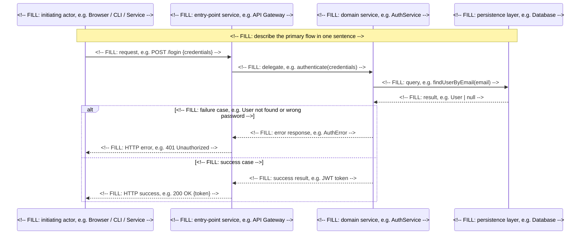

<!-- UNFILLED: Sequence Diagram — Primary Flow -->
<!-- Replace participant labels and messages with real actors and contracts -->
# Sequence Diagram: Primary Flow

```mermaid
sequenceDiagram
    participant Client as <!-- FILL: initiating actor, e.g. Browser / CLI / Service -->
    participant API as <!-- FILL: entry-point service, e.g. API Gateway -->
    participant Service as <!-- FILL: domain service, e.g. AuthService -->
    participant Store as <!-- FILL: persistence layer, e.g. Database -->

    Note over Client,Store: <!-- FILL: describe the primary flow in one sentence -->

    Client->>API: <!-- FILL: request, e.g. POST /login {credentials} -->
    API->>Service: <!-- FILL: delegate, e.g. authenticate(credentials) -->
    Service->>Store: <!-- FILL: query, e.g. findUserByEmail(email) -->
    Store-->>Service: <!-- FILL: result, e.g. User | null -->

    alt <!-- FILL: failure case, e.g. User not found or wrong password -->
        Service-->>API: <!-- FILL: error response, e.g. AuthError -->
        API-->>Client: <!-- FILL: HTTP error, e.g. 401 Unauthorized -->
    else <!-- FILL: success case -->
        Service-->>API: <!-- FILL: success result, e.g. JWT token -->
        API-->>Client: <!-- FILL: HTTP success, e.g. 200 OK {token} -->
    end
```
