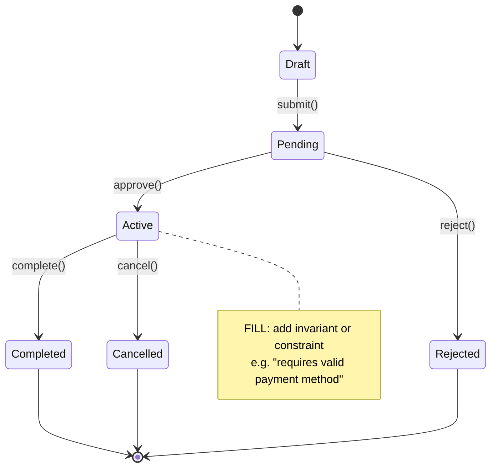

<!-- UNFILLED: State Machine — Primary Entity -->
<!-- Replace state names (Draft, Pending, Active, etc.) and transition labels -->
<!-- with the actual lifecycle states of your domain entity.               -->
# State Machine: Primary Entity

